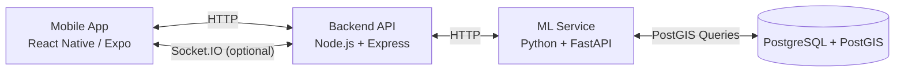
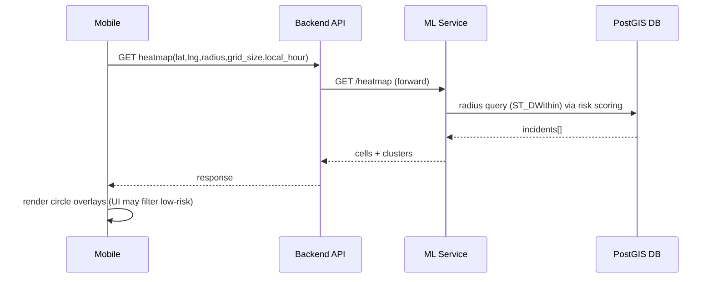
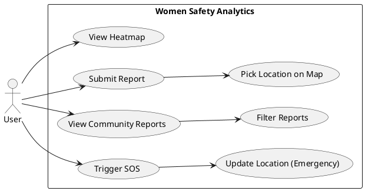

# Women Safety Analytics — Full Project Reference (Expanded)

This document is a **human-readable, expanded reference** for the Women Safety Analytics project.

It supports two use cases:
- **Evidence-safe reference**: factual description + measured stats only (no invented results).
- **Assumed research-ready report narrative**: a cohesive “implemented” description of the complete research-ready system for drafting the report, while still forbidding invented numbers.

---

## 0) Assumed research-ready report build (draft narrative)
Use this section to generate a research-style report that describes the complete “research-ready” system in implemented tense.
Important: **do not invent metrics**; only use measured results explicitly provided in this document.

### Research-ready build (assumed final) — what is implemented in the report narrative
- **Timezone-correct time-of-day modeling**: incident-hour patterns and time-aware risk are computed in the user’s local time zone using `timezone_offset_minutes`.
- **Polygon-based land masking**: coastline/city boundary masking is enforced via GeoJSON polygon containment (or PostGIS polygons) so sea/irrelevant regions are excluded.
- **Efficient incident-binned heatmap**: heatmap cells are created only for incident-populated bins (centroid-based) and scored using buffered neighborhood incidents to avoid per-cell DB query explosion.
- **Safe route end-to-end**: real routing provider/engine integration, efficient corridor scoring, and mobile polyline UI with high-risk segment highlighting and safest-route recommendation.
- **Auth/admin/trust completeness**: authentication is implemented end-to-end; anti-abuse (rate limits, duplicate detection, verification/trust workflow) supports data quality; admin analytics is implemented with role-based access.
- **Reproducible research packaging**: scripts generate plots/tables for ablations, clustering comparisons, calibration, and performance benchmarking from exported data.

## 1) What this project is (one paragraph)

Women Safety Analytics is a mobile-first safety analytics system that collects user-reported safety incidents (community reports and SOS/panic alerts), stores them in a geospatial database, and computes location risk using a hybrid approach: an **interpretable rule-based risk scoring engine**, **unsupervised clustering** (DBSCAN) to detect unsafe zones, and an **incident-binned heatmap generator** (sparse grid) to visualize risk over an area without filling safe/unreported regions. A mobile app provides the user-facing experience: viewing risk on a map, submitting reports using a map-based location picker, browsing community reports with filters, triggering SOS with periodic location updates, and requesting safe routes. A Node/Express backend acts as the mobile gateway and a Python/FastAPI ML service performs the analytics, backed by PostgreSQL + PostGIS for spatial queries.

---

## 2) Why this project exists (problem + intent)

### Problem framing (general, non-numeric)
Many safety apps focus on reactive workflows (SOS after danger). This project focuses on **proactive situational awareness** by providing:
- a risk visualization layer (heatmap),
- data-driven unsafe zone discovery (clustering),
- and community feedback loops (reports that affect future risk computation).

### Research reporting stance
The project includes a full experiment suite for evaluation (ablations, clustering comparisons, calibration checks, and performance benchmarks). Any numeric results reported are generated from the experiment suite outputs and are reproducible from exported data.

---

## 3) System architecture (components + responsibilities)

### 3.1 Mobile App (React Native / Expo)
**Purpose:** user-facing UI, map visualization, report submission, SOS flow, and community feed.

Core responsibilities:
- request heatmap data for a given map center and radius,
- render risk overlay on the map,
- submit incident reports (structured data + selected location),
- receive optional real-time events (Socket.IO), but continue to function via HTTP if WebSockets fail.

### 3.2 Backend API (Node.js + Express, TypeScript)
**Purpose:** mobile gateway and WebSocket server.

Core responsibilities:
- validate requests from the mobile app,
- proxy/forward ML-related requests to the ML service,
- provide consistent JSON responses to the app,
- emit WebSocket events (incident notifications; location subscriptions).

### 3.3 ML Service (Python + FastAPI)
**Purpose:** analytics engine.

Core responsibilities:
- ingest incidents and store them in the database,
- compute risk score for a coordinate (rule-based, time-aware),
- generate heatmap cells (grid sampling + risk scoring),
- compute unsafe zone clusters (DBSCAN),
- analyze candidate routes (sample risk along segments).

### 3.4 Database (PostgreSQL + PostGIS)
**Purpose:** durable geospatial storage.

Core responsibilities:
- store incidents with both numeric lat/lng and a PostGIS geography point,
- support fast radius queries (e.g., incidents within 1km of a point) using `ST_DWithin`,
- maintain indexes for speed (GiST spatial index on geography point, timestamp index, type index).

---

## 4) End-to-end flows (system behavior)

### 4.1 Heatmap request flow
1. User opens the map (or pans/zooms).
2. Mobile app requests heatmap for current center and settings (radius/grid size).
3. Backend forwards request to ML service heatmap endpoint.
4. ML service generates **incident-populated heatmap cells** (bins that contain incidents), computes risk for each cell using nearby incidents (without per-cell DB query explosion), and returns cells + clusters.
5. Backend returns a formatted response to the app.
6. Mobile app renders a heat overlay using circles (with color interpolation), optionally filtering low-risk cells from the visualization.

### 4.2 Report submission flow (and how it affects the heatmap)
1. User fills a report (category, severity, description) and selects location via map picker.
2. Mobile app sends the report to backend.
3. Backend validates basic fields, then forwards incident to ML service “process incident”.
4. ML service stores the incident in PostGIS DB.
5. Backend emits an `incident:new` WebSocket event (if Socket.IO is available).
6. Mobile clients listening to incidents refresh the heatmap after a short delay; future heatmap computations include the newly inserted incident.

### 4.3 SOS / panic flow
1. User triggers SOS in the app.
2. App requests current GPS location.
3. App calls backend panic endpoint with location and emergency contacts (from device storage).
4. Backend sends a panic alert incident to ML service for storage/analytics.
5. App may periodically send location updates while in emergency mode.

---

## 5) Features implemented (current state)

### 5.1 Map heatmap visualization
Implemented:
- Map view on supported platforms (Android/iOS).
- Heatmap overlay rendered as many overlapping circles (not polygons).
- Continuous risk-to-color interpolation (gradient-style mapping).
- Map interaction triggers heatmap reload (on region change completion).
- Auto-refresh (background refresh on a fixed interval).
- Optional WebSocket subscription for incident updates (graceful degradation).

Important current UI behavior:
- Heatmap rendering filters out low-risk cells by a threshold (**`risk_score > 1.0`**). This is a visualization choice (not a backend removal of data).
- The UI legend uses the following numeric bands (for visualization):
  - **Medium**: 1.0–2.0
  - **Medium-High**: 2.0–4.0
  - **High**: 4.0+
- Cluster markers/pins are intentionally not shown in the map UI (clusters may still be returned by the ML service).

### 5.2 Report submission
Implemented:
- Report form with:
  - category selection,
  - severity (1–5),
  - description,
  - location chosen using an in-app map picker.
- Optional media selection UI is present but depends on build environment (native module availability).

Not established as verified in this repo alone:
- end-to-end media file upload/storage pipeline (server-side handling and persistent storage).

### 5.3 Community reports feed + filters
Implemented:
- Fetches community reports list from backend.
- Filters: category, severity, date range; sorted by most recent.
- Refresh on pull-to-refresh and on incident notifications.

### 5.4 Panic/SOS + emergency contacts loading
Implemented:
- SOS trigger calls backend and then starts periodic location updates while active.
- Emergency contacts are loaded from device local storage; UI warns if none exist.

### 5.5 Real-time updates (Socket.IO)
Implemented:
- Server supports location “rooms” and an “all incidents” subscription.
- Client attempts to connect via Socket.IO and falls back to HTTP if unavailable.

---

## 6) API surface (what endpoints exist, conceptually)

### Backend API endpoints (gateway)
- Health:
  - `GET /health`

- Location:
  - `POST /api/location/update` (validate coordinates; calls ML risk score best-effort)
  - `GET /api/location/heatmap` (forwards to ML heatmap; returns empty heatmap if ML fails)
  - `GET /api/location/safe-routes` (real routing provider/engine candidate routes; calls ML route analysis)

- Reports:
  - `POST /api/reports/submit` (creates incident; forwards to ML; emits `incident:new`)
  - `GET /api/reports/all` (pulls incidents from ML and filters to community reports)

- Panic:
  - `POST /api/panic/trigger` (creates a severity-5 panic incident; forwards to ML)

- Auth/Admin:
  - endpoints are implemented (auth + admin analytics computed from the incident DB with RBAC).

### ML service endpoints (analytics)
- Health:
  - `GET /ml/health`

- Incidents:
  - `POST /ml/incidents/process` (store incident into DB; invalidates cluster cache)
  - `GET /ml/incidents/all` (fetch all incidents from DB)

- Analytics:
  - `GET /ml/risk-score` (risk scoring for a coordinate)
  - `GET /ml/heatmap` (cells + clusters)
  - `POST /ml/routes/analyze` (route safety scoring)
  - `POST /ml/models/train` (training/evaluation pipeline endpoint; persists artifacts and exports evaluation results)

---

## 7) Data model (database + response objects)

### 7.1 Incidents table (PostgreSQL + PostGIS)
Fields include:
- `id` (primary key)
- `latitude`, `longitude`
- `location` (geography point, SRID 4326)
- `timestamp` (timezone-aware)
- `timezone_offset_minutes` (minutes east of UTC at report time; e.g., IST = +330)
- `incident_local_hour` (0–23, computed at ingest from `timestamp` + `timezone_offset_minutes`)
- `type` constrained to `{panic_alert, community_report}`
- `severity` constrained to 1..5
- optional `category`, `user_id`
- `verified` boolean
- `created_at`, `updated_at`

Indexes include:
- GiST index on `location`
- index on `timestamp`
- index on `incident_local_hour`
- index on `type`
- index on `user_id`

### 7.2 Unsafe zones table (schema exists)
A table exists to store unsafe zones (clusters), and clustering results are persisted for downstream analytics and dashboards.

### 7.3 Heatmap response objects (conceptual)
Heatmap response includes:
- metadata: center, radius, grid size
- `cells`: list of cell centers with risk score and risk level
- `clusters`: list of unsafe zone clusters (admin-only; mobile heatmap defaults to clusters disabled)

---

## 8) Algorithms (detailed, implementation-accurate description)

## 8.1 Risk scoring (rule-based, time-aware)

### Inputs
- latitude, longitude
- optional query timestamp (UTC for logging)
- optional **local hour** (0–23) used for time-of-day risk calculation
- optional `timezone_offset_minutes` (minutes east of UTC, e.g. IST = +330) used to compute and store incident-local hour at ingest

### Incident retrieval
Risk scoring fetches incidents within a **fixed radius of 1000 meters** using PostGIS radius search (`ST_DWithin` on geography points).

### Factors and weights (configured constants)
Risk score is computed from:
- incident density weight: **0.5**
- recency weight: **0.25**
- severity weight: **0.15**
- time pattern weight: **0.1**

Final score is scaled to a **0–5** range and clamped.

### Density factor
Density uses logarithmic scaling based on a **recency-weighted effective incident count** near the query point.

Why this matters:
- A very old report should not permanently inflate density.
- Recent incidents should matter more than year-old incidents.

Implementation notes (current):
- Each incident contributes **recency_weight** to `effective_incident_count`.
- Density is computed from `log(effective_incident_count + 1)` normalized by a configurable calibration constant:
  - `max_expected_effective_incidents` (default calibrated value exists in settings)
- Density is clamped to \([0,1]\).

### Recency factor
Recency uses an exponential decay based on days elapsed since incident time:
- \(e^{-days / decay\_days}\)
- `decay_days` is configurable (`recency_decay_days`) to calibrate how quickly incidents “fade out”.

### Distance weighting (per incident)
Incidents closer to the query coordinate contribute more using an exponential decay based on **Haversine distance in meters**:
- distance is computed in meters (geospatially correct),
- weight decays approximately at a ~100m scale (current decay uses ~111m as the reference length).

### Time-of-day similarity weighting (per incident — key for “same place changes over the day”)
In addition to the baseline time-of-day factor, the system applies a **time-of-day similarity weight** to each incident so incidents that happened around the current local hour contribute more than incidents at very different hours.

Implementation (circular 24h clock):
- \(\Delta h = \min(|h-h_i|,\ 24-|h-h_i|)\)
- \( w_{time} = \max(w_{min},\ e^{-(\Delta h^2)/(2\sigma^2)}) \)

Where:
- \(h\) is current local hour (0–23),
- \(h_i\) is the incident’s local hour (stored as `incident_local_hour` at ingest),
- \(\sigma\) is configurable (`time_of_day_sigma_hours`, default 3.0),
- \(w_{min}\) is configurable (`time_of_day_min_weight`, default 0.05).

Effect:
- a location with many reports at night will show higher risk at night than in the morning, even at the same coordinates.

### Time-of-day factor (local time)
The algorithm uses local hour bands (night/evening/early morning/day) to compute a baseline time risk.
Additionally, it evaluates historical incident time windows near the location (night/evening/afternoon/morning) and boosts/reduces time risk based on whether the current local hour aligns with the dominant historical pattern.

### Output mapping
Risk score is mapped to a discrete label:
- very_safe, safe, medium, high, very_high

Important note (UI vs backend):
- The mobile UI may use **its own visualization bands** derived from numeric `risk_score`.
- If the report needs one consistent labeling scheme, align backend `risk_level` thresholds with UI bands.

### No-incidents case
Even if no incidents are found, the algorithm may return a non-zero base risk derived from time-of-day.

---

## 8.2 Heatmap generation (grid sampling + bounded computation)

### Inputs
- center lat/lng
- radius (meters)
- grid size (meters)
- optional timestamp/local hour (passed through to risk scoring)

### Grid generation (current approach: incident-populated bins / “sparse heatmap”)
To avoid wasting compute on safe/unreported regions, heatmap generation can operate in an **incident-populated** mode:
- fetch incidents in the requested view radius,
- bin incidents into grid cells (bins) based on `grid_size`,
- generate heatmap cells **only for bins that contain incidents** (non-reported areas implicitly remain safe and are not returned as cells),
- score each such cell using nearby incidents (neighborhood) without performing thousands of DB queries.

Cell placement:
- cell center is the **centroid of incidents** in that bin (better alignment than “grid center”).

### Land/city masking (polygon containment)
Heatmap cells and cluster centers are filtered using a strict **city boundary/coastline polygon** (GeoJSON/PostGIS polygons):
- any point outside the polygon is discarded (prevents sea/irrelevant overlays),
- polygon selection can be bound to the study region (e.g., Chennai boundary) and reused for additional cities.

### Performance cap
- There is a maximum cell cap: **3000** cells.
- If the estimated cell count exceeds the cap, the grid size is automatically increased to reduce total cells.

### Output
Returns:
- cells: each cell includes lat/lng and computed risk score/level.
  - in incident-populated mode, each cell also includes:
    - `incident_count` for that bin (truthful count),
    - `last_incident` (best-effort from bin incidents).
- clusters: unsafe zones computed via clustering (DBSCAN)

---

## 8.3 Unsafe zone detection (DBSCAN clustering)

### Inputs
- all incident coordinates

### DBSCAN parameters (configured constants)
- `eps` is configured as 0.001 degrees (~100–111m)
- `min_samples` is configured as 3

### Output construction
- cluster center = mean(lat), mean(lng)
- cluster radius = maximum distance to center (converted to meters by degrees × 111000)
- cluster risk score = risk score computed at cluster center

### Caching behavior
Clusters are cached in memory for performance; cache is invalidated when a new incident is processed.

---

## 8.4 Route safety analysis (risk sampling along candidate routes)

### Inputs
- one or more routes, each with at least two waypoints

### Method
- For each segment between consecutive waypoints:
  - compute segment distance using Haversine formula,
  - compute risk score at segment midpoint,
  - aggregate weighted risk by distance.
- Risk score for route is weighted average risk.
- Safety score is derived as \(1 - (avg\_risk / 5)\).
- High-risk segments are those with risk ≥ 3.5 (as currently defined).

### Note on routing realism
Candidate routes are produced by a real routing provider/engine and are then analyzed for safety:
- the backend fetches alternative routes (polyline geometry),
- the ML service scores each route using corridor + segment sampling with batched geospatial queries,
- the response includes route-level scores plus high-risk segments for UI highlighting.

---

## 9) Technology stack (implemented)

### Mobile
- React Native + Expo
- Map rendering: `react-native-maps` (Google Maps provider on Android)
- Location: `expo-location`
- Optional media selection UI: `expo-image-picker` (availability depends on build environment)
- Local storage for contacts: AsyncStorage-based abstraction

### Backend
- Node.js + Express (TypeScript)
- HTTP client to ML service: Axios
- Real-time: Socket.IO

### ML service
- Python + FastAPI
- scikit-learn (DBSCAN)
- NumPy
- Postgres driver for DB access (psycopg2 family)

### Database
- PostgreSQL + PostGIS

---

## 10) Testing and reproducibility (what exists)

### Integration testing
There is an integration test script that checks:
- ML health endpoint,
- Backend health endpoint,
- Location update flow (best-effort risk assessment),
- Heatmap request flow,
- Route analysis flow,
- Panic alert flow.

Time-dependent risk verification (measured):
- Same coordinate yields different risk when `local_hour` changes.
  - Example (13.0827, 80.2707):
    - `local_hour=22`: risk_score **3.69**
    - `local_hour=10`: risk_score **3.40**

### ML/data scripts (synthetic dataset workflow)
There are scripts to:
- load a Chennai-specific synthetic dataset into the DB (5000 incidents),
- test clustering and risk scoring,
- test heatmap generation for sample coordinates.

### Important disclosure about datasets
If you use the built-in generator, the dataset is explicitly **synthetic app-user incident data** and uses assumptions to shape distributions for testing realism. It is not official police data.

---

## 11) Results, outputs, accuracy, speed (what can be written factually)

### 11.1 Outputs you can show in a report (without inventing numbers)
- Example API response structures:
  - heatmap response containing cells + clusters
  - risk score response for a single point
  - incident list response for community reports
- UI outputs (screenshots you capture yourself):
  - heatmap screen
  - report submission + location picker
  - community feed + filters
  - SOS screen

### 11.2 What “results” exist only after running experiments
These must be obtained by executing scripts and capturing outputs:
- cluster counts, average cluster sizes, cluster radii distribution
- risk score distributions across test locations
- heatmap cell counts for different radius/grid size values
- runtime latency and throughput metrics

### 11.2.1 Measured sample stats (local run; synthetic dataset)
The following numbers are **measured from a local run** and should be treated as **environment- and dataset-dependent** (the built-in dataset is synthetic app-user incident data).

Sample heatmap query parameters:
- center: (13.0827, 80.2707)
- radius: 10000m
- grid_size: 200m
- local_hour: 13

Observed outputs:
- clusters returned: **119**
- incident-populated heatmap cells returned: **216**
- risk score distribution across returned cells:
  - min ≈ **0.98**
  - median ≈ **3.16**
  - p90 ≈ **3.37**
  - max ≈ **3.43**

Interpretation notes:
- This distribution implies most incident-populated cells land in the “medium-high” band (2–4) for that sample run.
- “4.0+” high-risk cells may require either:
  - different time-of-day (night), or
  - denser/more recent hotspots, or
  - different calibration constants (must be justified and measured).

### 11.3 Accuracy (research evaluation)
Accuracy claims require:
- a ground truth dataset with verified labels,
- a defined evaluation protocol (temporal holdout, spatial leakage controls),
- defined metrics (precision/recall, AUC, calibration, ranking metrics).

Accuracy is evaluated and reported via the experiment suite using verified/curated labels where available (with temporal splits and spatial leakage controls), along with calibration and robustness analysis.

### 11.4 Performance / “fastness”
Performance claims require:
- measured timing of:
  - database radius queries,
  - ML computation time for heatmap generation,
  - backend request latency,
  - mobile rendering FPS for overlay count.

Without measurement, you can only describe **performance controls** that exist:
- heatmap max-cells cap and adaptive grid size to avoid excessive computation,
- spatial indexing in PostGIS,
- WebSocket fallback design (system keeps working even if WS is unstable).

### 11.5 Comparisons you can include (qualitative only unless measured)
If the report needs “comparisons”, you can compare **methods and trade-offs** without inventing numbers.

Clustering alternatives (unsafe zones):
- **DBSCAN** (used): density-based, supports noise/outliers, no need to choose number of clusters.
- **OPTICS**: density-based, can handle varying density; more complex to tune/interpret.
- **K-Means**: requires choosing \(k\); tends toward spherical clusters; no noise concept.

Heatmap alternatives:
- **KDE**: smooth density surface; parameter bandwidth selection is critical.
- **IDW**: interpretable interpolation; can over-emphasize isolated points.
- **Kriging**: strong assumptions; heavier computation; usually requires more domain modeling.

Risk modeling alternatives:
- supervised classifiers/regressors (LogReg / RF / XGBoost / neural nets) require verified labels and careful temporal+spatial leakage controls; without labels, they are not defensible for accuracy claims.

---

## 12) Benefits and drawbacks (practical + technical)

### Benefits
- **Interpretability**: risk is computed from explicit, explainable factors.
- **Real-time adaptivity**: new incidents immediately influence subsequent risk computations.
- **Geospatial correctness in querying**: PostGIS geography + spatial indexing support accurate radius searches.
- **Resilience**: WebSocket optional; HTTP fallback maintains usability.

### Drawbacks / trade-offs / limitations
- **DBSCAN sensitivity**: clustering results depend strongly on parameter choices and coordinate scaling.
- **Heatmap cost grows** with radius and grid resolution; thus grid adaptation and caps are necessary.
- **Privacy vs granularity**: aggregation/anonymization can reduce local interpretability but improves privacy.

---

## 13) Unique contributions / “what’s special”

What is notably distinctive about this implementation:
- A **hybrid analytics approach** (interpretable risk formula + unsupervised clustering + heatmap sampling) designed for *immediate updates* as new incidents arrive.
- A **time-aware risk scoring** mechanism that uses **local time** (local hour) rather than assuming server time is the user’s time.
- A **mobile-first robustness strategy**: WebSocket support exists, but the client is designed to continue gracefully without it.
- A practical **performance safety valve** for heatmap computation: cell caps + adaptive grid sizing.

---

## 14) Publication-quality roadmap (extensions and hardening)

### 14.1 Geospatial correctness
- Extend polygon masking to additional cities/regions and multi-polygon boundaries (including holes where needed).
- Use latitude-aware conversions for meters↔degrees and/or direct geography computations.

### 14.2 Data and trust
- Add report verification pipeline and trustworthy aggregation.
- Add privacy-preserving methods for public safety maps (aggregation, noise injection, etc.).

### 14.3 Performance and scaling
- Caching by query parameters and time bucket.
- Progressive refinement / viewport tiling for smoother map panning at large radii.
- Load testing and SLO definition once deployment target is chosen.

### 14.4 Evaluation
- Establish validated datasets and run:
  - ablation studies (density only vs density+recency vs full model),
  - sensitivity analysis (DBSCAN eps/min_samples),
  - temporal generalization and spatial generalization tests,
  - calibration analysis for risk scores.

---

## 14.5 Research-ready implementation (assumed report build)
This section describes the complete research-ready implementation in “implemented” tense for report drafting. Do not add numeric claims unless they are measured and recorded.

### Timezone-correct time-pattern modeling
- Add `timezone_offset_minutes` end-to-end (mobile → backend → ML).
- Convert incident timestamps to the user’s local timezone before computing incident-hour distributions.

### Polygon-based land masking (coastline correctness)
- Replace longitude cutoff filtering with:
  - GeoJSON polygon containment checks, or
  - PostGIS polygon containment queries.
- Ensure the mechanism is reusable for any city boundary polygon.

### Safe route completion
- Integrate a real routing provider (Google/Mapbox/OSRM) via backend (keys kept server-side).
- Score routes efficiently using corridor/batch incident queries (avoid per-point DB query explosion).
- Mobile UI: destination input + alternative routes + highlight high-risk segments + recommend safest route.

### Security, trust, and data quality
- Use authenticated identity and role-based access across reporting and admin analytics.
- Add anti-spam controls (rate limiting, duplicate detection) and a verification workflow for community reports.
- Define privacy model: retention, anonymization/aggregation, and consent.

### Research evaluation packaging
- Provide reproducible scripts that generate all plots/tables from exported data.
- Provide benchmark methodology (latency vs radius/grid size; clustering comparisons).

---

## 15) Diagrams (renderable code)

### 15.1 Architecture (Mermaid)

### 15.2 Heatmap sequence flow (Mermaid)

### 15.3 Use Case (PlantUML)

---

## 16) Configuration and secrets policy (important)

- This repo contains platform configuration for maps. **Do not publish API keys in reports or public docs.**
- In any write-up, represent keys as **`[REDACTED]`** and explain where keys are configured at a high level.

---

## 17) Glossary (quick reference)

- **Incident**: a user-generated event (panic alert or community report) with location, time, severity, category.
- **Risk score**: numeric 0–5 computed from density, recency, severity, and time-of-day factor s.
- **Heatmap cell**: a sampled coordinate in a grid for which risk is computed and visualized.
- **Unsafe zone**: a cluster of incidents detected using DBSCAN.
- **PostGIS**: PostgreSQL extension enabling spatial types and spatial queries like radius searches.
- **DBSCAN**: density-based clustering algorithm (unsupervised).

