# SafeNaari
Team: Skill Issue

## Adversarial Defense & Anti-Spoofing Strategy

500 people, one Telegram group, one spoofing app, one weather alert. They didn't hack our system. They hacked human coordination. So that's what we built a defense around.

### The honest admission first
GPS verification was never going to be enough. The moment you make a payout rule, someone will reverse-engineer it. What we built instead is a system that gets harder to fool the more people try to fool it at once, because scale is exactly what betrays a fraud ring.

A real delivery worker stuck in a storm is a statistical outlier. Five hundred fake ones, all filing at the same time, from the same part of the city, on phones with the same suspicious app install, that's not an outlier. That's a flare.

### 1. How we tell the difference
#### The phone knows more than its GPS
Every smartphone is carrying a small city of sensors, accelerometer, gyroscope, barometer, cell radio, battery monitor. A person genuinely caught outside in a thunderstorm has all of these talking at once. Rain affects signal. Wind affects movement. Stress affects how someone uses their phone.

Someone lying on their couch in Andheri West with a spoofing app running has perfectly stable readings. No signal multipath noise. No movement variance. A barometric reading that matches indoor air pressure. A battery draining at home idle rate. The GPS says they're in a flood zone. Everything else says they're watching YouTube.

We don't rely on any single signal. We take the whole picture, and we ask: does this make physical sense?

#### The network doesn't lie as easily as GPS
A spoofed GPS coordinate can put you anywhere on Earth in 200 milliseconds. Moving your phone's actual cell tower association is a different problem entirely. We compare the claimed location against the serving tower ID, the IP geolocation, and the frequency of network handoffs. Someone genuinely moving through a storm shows chaotic network behavior. Someone stationary at home shows one tower, stable signal, no handoffs. That gap is meaningful.

#### The platform remembers where you actually were
Before any claim reaches our fraud model, we pull the worker's operational trail from earlier that day, last confirmed delivery scan, route progress, kilometers logged. A worker who completed three deliveries in Kurla two hours ago and is now claiming to be stranded in Powai has some explaining to do. Not an automatic rejection, but a raised eyebrow.

### 2. The data we actually use
We don't need much. We need the right things.

From the device:
Accelerometer variance (is this body in motion, or at rest?), barometric pressure (indoors or outdoors?), GPS signal noise (real urban GPS drifts - perfect coordinates are suspicious), mock location API status, and battery drain rate relative to the claimed activity.

From the network:
Cell tower ID vs GPS claim delta, IP geolocation cross-check, RSSI variance over the last 10 minutes, and handoff count (a moving person in a city changes towers; a stationary person doesn't).

From the platform:
Last delivery confirmation timestamp and location, app foreground/background state, session continuity, and whether the worker's route today was anywhere near the claimed distress zone.

From the outside world:
IMD district-level alerts, OpenMeteo hyperlocal API, NDRF warnings. We verify that the weather at the actual pincode is claim-worthy, not just that a red alert exists somewhere in the city.

From the crowd:
This is the part that catches syndicates. Every claim is also fed into a live population view. We track:
How many claims are arriving from the same 1.2 km^2 zone right now, versus the historical baseline for that zone at this hour in this kind of weather event?
Is the device fingerprint entropy in this incoming cohort unusually low? (Everyone downloaded the same APK from the same Telegram link. Their devices look like siblings.)
Are these workers connected in any detectable way, same delivery zone, same app version, suspiciously similar claim timestamps, no prior co-occurrence on routes?

A genuine emergency produces messy, diverse, scattered claims. A coordinated attack produces a suspiciously clean statistical signature. We built our system to read that difference.

### 3. What happens when a claim gets flagged, and why we obsess over this part
Flagging is where most fraud systems fail honest people. We refuse to let that happen.

The system has three paths, and we're deliberate about which one each claim takes.

Green path: auto-approve
Risk score below threshold. Payout hits within 2 minutes. No friction, no forms, no questions. This is the default for most genuine claims, and it stays the default. We don't make honest workers prove their innocence just because fraud exists.

Yellow path: soft challenge
Something is mildly off, maybe the GPS noise is low, maybe there's a minor sensor anomaly, maybe connectivity was bad because of the storm itself, which is ironic, but common. We ask for one thing: a 15-second video or a quick photo of the surroundings. The prompt reads: "A quick look at where you are helps us process this faster." Not: "We think you're lying."

If the worker is in a genuinely terrible network situation, which is exactly the scenario the product is designed for, we check whether an active official weather alert covers their zone. If it does, the photo request becomes optional, not mandatory. We don't penalize bad connectivity during the event we're insuring against.

Payout holds for up to 30 minutes. If the check passes: green path. If inconclusive: red path.

Red path: human eyes
High risk score, or the claim is part of a flagged cohort. A human reviewer looks at it within 4 hours. The worker gets a clear, non-accusatory message: "Your claim is being reviewed. We'll update you within 4 hours. You can keep working."

Critically, their ability to work is never blocked. Only the payout waits.

If the cohort-level investigation resolves, say, the burst of claims turns out to be a genuine neighborhood event, every claim in that cohort gets batch-approved without individual review. We don't make 50 honest workers suffer because they filed at the same time as a suspicious cluster.

### The things we will never do
We will never tell a worker they're suspected of fraud. We will never auto-cancel without a human decision. We will never use a static threshold that ignores the weather event context. And if a claim is flagged and later found clean, that data feeds back into the model, so we get smarter about false positives over time, not just false negatives.

A worker with a long history of clean claims who gets flagged once is treated differently than a new account with no history. Trust is earned, and we track it.

### The underlying logic
The syndicate's attack works by making individual claims look legitimate. Our defense works by making the collective pattern of fraud impossible to hide. The more of them there are, the louder the signal.

They can upgrade their spoofing app. They cannot cheaply simulate the statistical fingerprint of a real weather emergency, diverse devices, scattered locations, organic timing, operational history that dates back weeks. That gap is our moat.