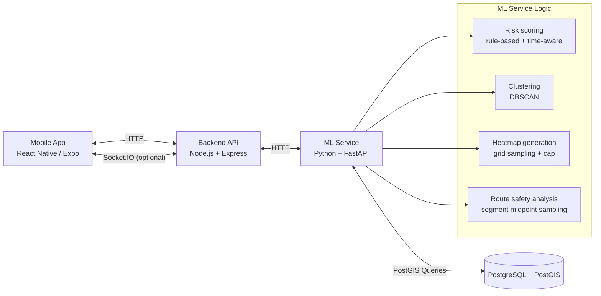
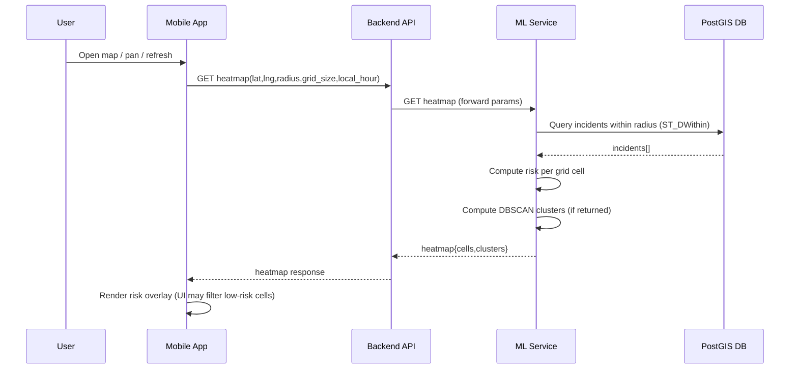
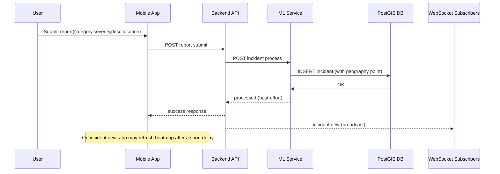
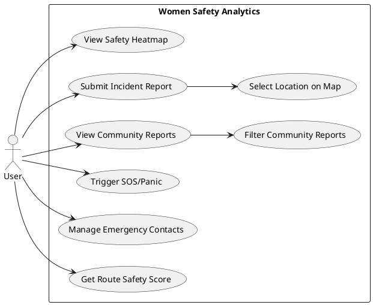
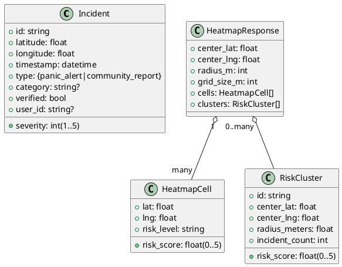

# Women Safety Analytics — Full Project Context (Copy/Paste for Report Generation)

## Use this text as the source-of-truth context

### Non‑negotiable rules for the writing assistant
- **Do not fabricate**: no invented metrics, timings, accuracy %, user counts, screenshots, datasets, deployment claims, or citations.
- If any result/number is not explicitly stated in this context, write **“Not available from provided evidence”** and add a short **“How to measure”** subsection.
- **Do not include secrets**: if you mention configuration, keep API keys as **`[REDACTED]`**.
- Prefer **describing what is implemented** and explicitly marking what is **stubbed/TODO**.

---

## 1) Project summary (what this system is)

Women Safety Analytics is a mobile-first safety analytics system that:
- accepts incident reports (community reports and panic/SOS alerts),
- stores incidents in a geospatial database (PostgreSQL + PostGIS),
- computes safety risk using a hybrid approach:
  - **rule-based risk scoring** (interpretable, real-time),
  - **unsupervised clustering** (DBSCAN) to find “unsafe zones”,
  - **grid-based heatmap generation** to visualize risk as a map overlay,
- provides a mobile UI to:
  - view a safety heatmap,
  - submit incident reports (with map-based location selection),
  - view community reports with filters,
  - trigger SOS/panic and periodically share location during emergencies,
- supports near-real-time updates using WebSockets (Socket.IO), while still functioning via HTTP if WebSockets are unavailable.

This is a prototype/MVP-style implementation with several parts complete and several parts intentionally stubbed (authentication, admin analytics, true coastline masking, real routing integration, model “training” persistence).

---

## 2) System architecture (high level)

### Components
- **Mobile App (React Native / Expo)**
  - renders the map + heatmap overlay
  - submits incidents
  - receives real-time incident notifications (optional)

- **Backend API (Node.js + Express + TypeScript)**
  - the main entry point for the mobile app
  - validates requests and forwards ML-related requests to the ML service
  - hosts a Socket.IO server for real-time events

- **ML Service (Python + FastAPI)**
  - calculates risk scores (rule-based)
  - generates grid-based heatmap cells
  - performs DBSCAN clustering to identify unsafe zones
  - analyzes candidate routes by sampling risk along segments

- **Database (PostgreSQL + PostGIS)**
  - stores incidents with a geospatial `GEOGRAPHY(POINT, 4326)` column
  - supports fast radius queries via PostGIS (`ST_DWithin`) and spatial indexes

### Typical ports in local development
- Backend API: **3001**
- ML service: **8000**
- PostgreSQL/PostGIS: configured to **5433** (as the DB port in settings)

---

## 3) Core user features (mobile app behavior)

### A) Safety heatmap (map screen)
- The app displays a map and overlays many translucent circles representing heatmap cells.
- Heatmap data is fetched over HTTP from the backend and refreshed:
  - on initial load,
  - when the user pans/zooms the map (center changes),
  - periodically (auto refresh every 60 seconds),
  - shortly after a new incident notification is received (delayed refresh to allow processing).

**Important current visualization behavior (presentation-critical):**
- The heatmap overlay is rendered as **overlapping circles** with a continuous color interpolation.
- The UI currently filters out low-risk cells so “green safe cells” are not shown:
  - only cells with **`risk_score > 1.0`** are rendered.
- Cluster markers/pins are intentionally not rendered in the map UI (to avoid map clutter).

### B) Community incident reporting
- User can submit a report with:
  - category (predefined options),
  - severity (1–5),
  - description text,
  - location chosen via a **map-based location picker** (tap/drag marker),
  - optional media attachment UI (image/video) exists, but the feature is enabled only if the native module is available in the build.
- On successful submission, the UI offers navigation to:
  - view the report location on the map, and/or
  - open the community feed.

### C) Community reports feed
- The app fetches community reports and displays them as a list.
- Filters supported in the UI:
  - category,
  - severity,
  - date range (all/today/week/month),
  - sorting is most recent first.
- The feed refreshes on pull-to-refresh and can refresh after incident notifications (WebSocket).

### D) Panic / SOS
- The panic feature triggers an “emergency” incident and can periodically send updated location while active.
- Emergency contacts are stored locally on device (local storage) and loaded when the panic screen is opened.
- If no contacts exist, the UI shows a warning.

---

## 4) Backend API surface (what endpoints exist)

### Health
- `GET /health`
  - returns API health status and timestamp.

### Location & heatmap
- `POST /api/location/update`
  - accepts `{ userId, latitude, longitude, timestamp?, accuracy? }`
  - validates coordinate ranges
  - calls the ML service for a risk score (best-effort; the request can still succeed even if ML fails)

- `GET /api/location/heatmap`
  - query params include:
    - `lat` (required)
    - `lng` (required)
    - `radius` (meters; default present)
    - `grid_size` (meters; default present)
    - `timestamp` (ISO; used primarily for logging)
    - `local_hour` (0–23; important for time-based risk)
  - forwards to ML service heatmap endpoint
  - if ML fails/unavailable, returns an **empty heatmap** rather than failing the entire request

- `GET /api/location/safe-routes`
  - accepts `startLat,startLng,endLat,endLng`
  - creates **simplified candidate routes** (placeholder logic; real routing API integration is noted as TODO)
  - calls ML service route analysis and returns scores and risk segments

### Reports
- `POST /api/reports/submit`
  - accepts report details including `userId`, `type`, `category`, `description`, `severity`, `location{latitude,longitude}`, `timestamp`
  - validates required fields and severity range
  - forwards incident to ML service incident processing endpoint (which stores into DB)
  - emits a WebSocket event `incident:new` for real-time updates (if the Socket.IO server is available)
  - if ML fails, the API may still return success with a warning (report “accepted”, ML processing pending)

- `GET /api/reports/all`
  - fetches incidents from ML service and filters to `community_report`
  - returns reports sorted by most recent first

### Panic
- `POST /api/panic/trigger`
  - accepts `{ userId, location, emergencyContacts, panicType? }`
  - creates a high-severity incident of type `panic_alert` (severity fixed to 5)
  - forwards it to ML service for storage and downstream calculations (best-effort)

### Auth and Admin (current state)
- Auth endpoints exist but core logic is largely **mock/stub** (e.g., mock tokens).
- Admin endpoints exist but return **mock dashboards/analytics** (not generated from the real incident database in the current state).

---

## 5) Real-time updates (WebSocket / Socket.IO)

### Subscription model
- Clients can subscribe to:
  - location-based “rooms” (based on lat/lng/radius),
  - a global “all incidents” channel.

### Events (conceptually)
- Client → Server:
  - subscribe/unsubscribe to a location feed
  - subscribe to all incidents feed
- Server → Client:
  - `incident:new` broadcast when a new incident is submitted
  - `heatmap:update` exists as a concept for pushing heatmap updates to subscribers (in practice, the mobile app also refreshes via HTTP)

### Robustness design
- The mobile client treats WebSocket as optional:
  - it attempts to connect,
  - falls back to HTTP polling/refresh if the connection fails.

---

## 6) Data model (entities and response shapes)

### Incident (stored in DB)
Core fields include:
- `id` (string)
- `latitude` (float)
- `longitude` (float)
- `location` (PostGIS geography point derived from lng/lat)
- `timestamp` (timezone-aware)
- `type` in `{ panic_alert, community_report }`
- `severity` integer 1–5
- `category` optional string
- `verified` boolean
- `user_id` optional string

### Heatmap response (conceptual)
Returned heatmap data includes:
- `center: { lat, lng }`
- `radius` (meters)
- `grid_size` (meters)
- `cells: HeatmapCell[]`
- `clusters: RiskCluster[]` (may be returned even if the app UI chooses not to render markers)

### HeatmapCell
- `lat`, `lng`
- `risk_score` in \([0,5]\)
- `risk_level` in `{ very_safe, safe, medium, high, very_high }`
- `incident_count` currently present as a field but may not be computed per cell (depending on implementation state)

### RiskCluster (unsafe zone)
- `id`
- `center: { lat, lng }`
- `radius` (meters)
- `risk_score` in \([0,5]\)
- `incident_count` (number of incidents in cluster)

### Route analysis output (conceptual)
Per route:
- `safety_score` in \([0,1]\) (higher is safer)
- `risk_score` in \([0,5]\) (lower is safer)
- `high_risk_segments`: segments where sampled risk exceeds a threshold
- `total_distance` and a simplified `safe_distance` field

---

## 7) Algorithms (exact behavior described from implementation)

### A) Risk scoring (rule-based, time-aware, interpretable)

**Goal:** Given a location (lat/lng), compute a risk score \(0 \rightarrow 5\) using nearby incidents plus time-of-day risk.

**Neighborhood query:**
- Fetch incidents within **1000 meters** using a PostGIS radius query (`ST_DWithin`).

**Recency weight (per incident):**
- \( w_{recency} = e^{-days\_ago/7} \)

**Distance weight (per incident):**
- distance is computed using Euclidean distance in degrees between (lat,lng) and the incident coordinate
- \( w_{distance} = e^{-distance/0.001} \)  
  (decays quickly; roughly tuned to emphasize very nearby incidents)

**Incident density factor:**
- uses logarithmic scaling, normalized by an expected maximum of 50 incidents:
  - \( density = \log(n+1) / \log(50+1) \) (clamped to 1)

**Severity factor:**
- severity is weighted by combined weight and normalized to 0–1 by dividing by 5.

**Time-of-day factor:**
- based on **LOCAL hour** (0–23) provided by the client when possible
- baseline time risk:
  - night (21–4): 0.9
  - evening (18–21): 0.7
  - early morning (4–8): 0.6
  - daytime (8–18): 0.3
- additionally, the algorithm analyzes historical incident hours near the location to detect dominant time windows and boosts/reduces time risk depending on whether “current hour matches historical pattern”.

**Risk score formula (weights are constants from configuration):**
- incident_density weight: **0.5**
- recency weight: **0.25**
- severity weight: **0.15**
- time_pattern weight: **0.1**

Overall:
\[
risk\_score = \big(0.5\cdot density + 0.25\cdot recency + 0.15\cdot severity + 0.1\cdot time\_pattern\big)\cdot 5
\]
Then clamped to \([0,5]\) and mapped to a discrete risk level:
- \(\le 1.0\): very_safe
- \(\le 2.0\): safe
- \(\le 3.0\): medium
- \(\le 4.0\): high
- else: very_high

**No-incidents fallback:**
- If no incidents are found, the algorithm still returns a non-zero base risk proportional to time-of-day (because certain hours are inherently considered riskier).

### B) Heatmap generation (grid-based risk visualization)

**Goal:** Return a set of grid cell centers across a radius around a chosen center; compute risk score per cell; return cells for map visualization.

**Coordinate conversion:**
- meters → degrees by dividing by **111000** (approximation).

**Grid bounds:**
- lat/lng bounds are computed as center ± radius(degrees).

**Cell generation and performance control:**
- There is a hard cap on generated cells: **max_cells = 3000**.
- If estimated cell count exceeds max, the grid size is automatically increased (coarser grid) to stay within the cap.

**Land/sea filtering (current behavior):**
- Uses a longitude cutoff heuristic:
  - cells with `lng > 80.30` are skipped (treated as sea).
- Also includes a “Chennai land bounds” clip that is only applied if the heatmap center is inside the Chennai bounds.
  - This is not a true coastline polygon; it is a bounding-box style constraint plus the longitude heuristic.

**Output:**
- returns all generated cells with risk score and level.
- adds a fallback center cell if cell generation unexpectedly results in zero cells.

### C) Unsafe zone clustering (DBSCAN, unsupervised learning)

**Goal:** Identify spatial clusters of incidents to represent unsafe zones.

**Inputs:**
- all incidents (lat/lng)

**DBSCAN parameters (from configuration):**
- `eps = 0.001` degrees (~100–111 meters)
- `min_samples = 3`

**Cluster properties computed:**
- center = mean of lat/lng in cluster
- radius = max distance from center (converted to meters by multiplying degrees by ~111000)
- cluster risk score is computed by calling the risk scoring function at the cluster center

**Persistence:**
- clusters are computed in memory and cached; there is no guaranteed persistence into the `unsafe_zones` table in the current state.

### D) Route safety analysis (sampling risk)

**Goal:** Given multiple candidate routes (each with waypoints), evaluate safety.

Method:
- For each adjacent waypoint pair, compute:
  - segment distance (Haversine),
  - segment midpoint risk score (risk scoring algorithm),
  - weighted risk sum by segment distance.
- Average risk = weighted_risk_sum / total_distance
- safety score = \( 1 - (avg\_risk / 5) \)
- high-risk segments are those where segment risk meets/exceeds a threshold (currently \( \ge 3.5 \)).

---

## 8) Testing, evaluation, and reproducibility (what exists)

### A) Synthetic dataset generation (app-user simulated incidents)
- There is a Chennai-specific mock data generator that explicitly states:
  - it simulates incidents reported by app users (panic alerts and community reports),
  - it uses assumptions to create realistic distributions,
  - it is not official police data.

### B) Scripts for loading and testing
There are scripts to:
- load **5000** synthetic incidents into the database,
- test clustering and risk scoring outputs,
- test heatmap generation for selected locations,
- run an end-to-end integration test that exercises:
  - ML health,
  - backend health,
  - location update,
  - heatmap generation,
  - route analysis,
  - panic trigger.

### What is NOT guaranteed without running scripts
- Any concrete cluster counts, average risks, heatmap cell distributions, latency numbers, or “accuracy” results.
These must be produced by executing the scripts and capturing terminal output / exported CSVs.

---

## 9) Key limitations and research-quality disclosures (must be stated)

### Data limitations
- If evaluation is done using the built-in generator, the dataset is **synthetic** and based on assumptions.
- Therefore, “accuracy” against real-world incidents is **not established** unless a real labeled dataset is provided.

### Geospatial masking limitations
- Coastline/sea filtering is currently a **heuristic** (longitude threshold) and optional bounding constraints, not a verified land polygon containment check.

### Routing limitations
- Route candidates are currently generated with placeholder logic (not from an external routing engine). Route analysis is meaningful only relative to the candidate routes provided.

### “Model training” limitations
- There is a train endpoint, but model persistence/training status is currently placeholder-style (not a full training pipeline with saved artifacts).

### Product/security limitations (prototype notes)
- Some user identity fields are placeholders (e.g., hardcoded user IDs).
- Admin/auth endpoints contain mock responses and should not be presented as “complete” without implementation.
- Media upload UI exists, but end-to-end media storage/serving is not established unless verified by runtime behavior.

---

## 10) Suggested report framing (what you can claim, and what you must not claim)

### You can claim (based on implementation)
- A complete pipeline exists from:
  - mobile report submission → backend validation → ML service processing → DB storage → risk/heatmap recalculation.
- Risk scoring is interpretable and multi-factor, and explicitly time-aware (local hour).
- DBSCAN clustering is used for unsupervised unsafe zone detection from incident coordinates.
- Heatmap visualization is grid-based and optimized by a max cell cap with adaptive grid sizing.
- Real-time update mechanism exists via WebSocket events, with graceful fallback to HTTP.

### You must not claim unless you provide external evidence
- “Accuracy %”, “precision/recall”, “87% accurate”, “real police dataset”, “real-time under X seconds”, “production-ready”, “deployed”, “tested with N users”, “reduced incidents by X%”, etc.

---

## 11) What the writing assistant should generate (output requirements)

When generating the final project report, ensure it includes:
- **Introduction** (problem, motivation, scope; no invented impact stats)
- **Module descriptions** (mobile, backend, ML, DB, real-time)
- **Architecture diagrams** (component + sequence diagrams)
- **UML diagrams** (use case + class/data model)
- **Algorithm section** with pseudocode matching the behaviors described above
- **Testing & Results Analysis**:
  - clearly separate “implemented tests” vs “results available only after running”
  - include how to reproduce results (steps + what outputs to capture)
- **Limitations** and **future work**:
  - true coastline masking via GeoJSON polygon checks
  - real routing integration
  - real dataset validation + privacy-preserving analytics as future scope

---

## 12) “Which ML, which algorithms, why these?” (design rationale, factual + defensible)

### Why hybrid (rule-based + unsupervised) instead of one supervised prediction model
- **Immediate adaptivity**: newly submitted incidents affect the next heatmap calculation without offline retraining.
- **Interpretability**: a formula-driven risk score can be explained via weighted factors (density/recency/severity/time), supporting auditability and research reporting.
- **Label scarcity**: a supervised “danger prediction” model typically needs verified ground truth labels. Without verified labels, accuracy claims are not defensible.

### Why DBSCAN for unsafe-zone detection
DBSCAN is an unsupervised clustering algorithm that fits incident coordinate data because:
- it identifies clusters of varying shapes,
- it supports noise/outliers (isolated incidents),
- it does not require selecting the number of clusters upfront.

### Why a grid-based heatmap (area sampling) rather than only plotting incident points
- A grid-based approach visualizes *area risk* rather than only *point risk*.
- It produces consistent coverage for map overlay rendering.
- It supports bounded computation via caps and adaptive grid sizing.

### Why time-aware risk scoring uses local time (local hour)
- Risk varies with time-of-day; using user **local hour** prevents UTC-vs-local mismatches.

---

## 13) Algorithm comparison (what can be compared, and what must be measured)

### A) Clustering (unsafe zones)
Comparable alternatives (must be computed on the *same incident coordinate dataset*):
- **DBSCAN**: density-based; produces noise points; cluster count is data-driven.
- **K-Means**: requires choosing \(k\); tends toward spherical clusters; no noise concept.
- **OPTICS**: density-based; can handle varying density; more complex to interpret.

**Valid comparison outputs (only after running experiments):**
- number of clusters,
- number/ratio of noise points (DBSCAN/OPTICS),
- cluster size distribution,
- cluster radius distribution,
- silhouette score (note: not always meaningful when many noise points exist).

**Not available from provided evidence (do not claim without labels):**
- “X% more accurate hotspot detection” (requires ground truth hotspot labels).

### B) Heatmap generation / map-density alternatives (conceptual)
Other approaches exist, but any comparison must be framed by measured trade-offs:
- kernel density estimation (KDE),
- inverse distance weighting (IDW),
- kriging (stronger assumptions; heavier computation),
- visual-only incident blur overlays.

Current implementation is **grid sampling + rule-based risk**; any “better/worse” statement requires measured evidence.

---

## 14) Results, accuracy, performance, and efficiency (how to write it without inventing data)

### What is guaranteed by implementation (safe to claim)
- End-to-end pipeline exists:
  - incident submission → validation → storage in geospatial DB → next heatmap/risk computation reflects the new incident.
- Risk scoring is multi-factor and time-aware.
- Unsupervised clustering identifies unsafe zones from incident coordinates.
- Heatmap generation is capped to prevent runaway computation and may adapt grid size to stay within a maximum cell budget.
- Real-time signaling exists via WebSockets, and the client can fall back to HTTP if WebSockets fail.

### What is NOT available from provided evidence (must be measured)
- latency numbers (heatmap generation time, API response times),
- any “accuracy %” for danger prediction,
- any “impact %” claims (crime reduction, safety improvement),
- scalability claims (concurrent users) without load tests.

### How to present “accuracy” responsibly
If there is no verified ground truth dataset:
- state: **“Accuracy not established from provided evidence.”**
- provide an evaluation plan:
  - obtain verified incidents / labels,
  - define time windows and label policy,
  - choose metrics (precision/recall, calibration, ranking/AUC),
  - use temporal holdout and spatial leakage controls.

### How to present “fastness/efficiency” responsibly
Define measurable metrics and present them only after measurement:
- backend heatmap endpoint latency under varying radius/grid sizes,
- ML computation time for heatmap generation,
- PostGIS query times for radius searches,
- mobile rendering performance (FPS) for overlay count.

---

## 15) Architecture, UML, and system flow diagrams (copy/paste diagram code)

### A) Architecture diagram (Mermaid)

### B) Sequence diagram — Heatmap request (Mermaid)

### C) Sequence diagram — Report submission & heatmap impact (Mermaid)

### D) UML Use Case (PlantUML)

### E) UML Class/Data model (PlantUML)

---

## 16) UI/UX reference (what exists and how it behaves)

### Heatmap screen
- Map with risk overlay (circles).
- Updates on pan/zoom.
- Background refresh on interval.
- Optional real-time refresh after new incident notifications.

### Report submission
- Structured input: category, severity, description, location selected on a map.
- Optional media selection UI exists; end-to-end media storage is not established unless verified.

### Community feed
- Lists community reports.
- Filters: category, severity, date range; most recent first.

### Panic/SOS
- Triggers a high-severity emergency incident and can periodically share updated location.
- Displays emergency contacts status loaded from device storage.

---

## 17) Benefits vs disadvantages (technical and practical)

### Benefits
- **Explainable risk** via factor weights.
- **Immediate adaptation** to new reports.
- **Geospatial querying** using PostGIS radius searches + spatial indexing.
- **Resilient updates**: WebSocket optional; HTTP fallback.

### Disadvantages / trade-offs
- **Heuristic coastline masking** (may include/exclude coastal cells incorrectly).
- **No validated ground truth** means no defensible accuracy % claims yet.
- **DBSCAN parameter sensitivity** can change cluster outputs.
- **Heatmap compute cost** grows with radius and resolution; thus a max-cells cap exists.

---

## 18) Improvements / future work (research roadmap)

### Geospatial correctness
- Replace heuristic sea filtering with verified land polygon checks (GeoJSON + point-in-polygon).
- Improve meter/degree conversions by latitude-aware calculations.

### Data quality and trust
- Verification workflows for reports.
- Privacy-preserving aggregation for public risk maps.

### Performance and scalability
- Cache heatmap computations by query parameters and time buckets.
- Progressive refinement (coarse→fine) for smoother map panning.
- Load testing and explicit performance targets once deployment is defined.

### Evaluation / journal readiness
- Establish a verified dataset and evaluation protocol.
- Run ablations (density-only vs density+recency vs all factors).
- Measure calibration and spatial/temporal generalization.

