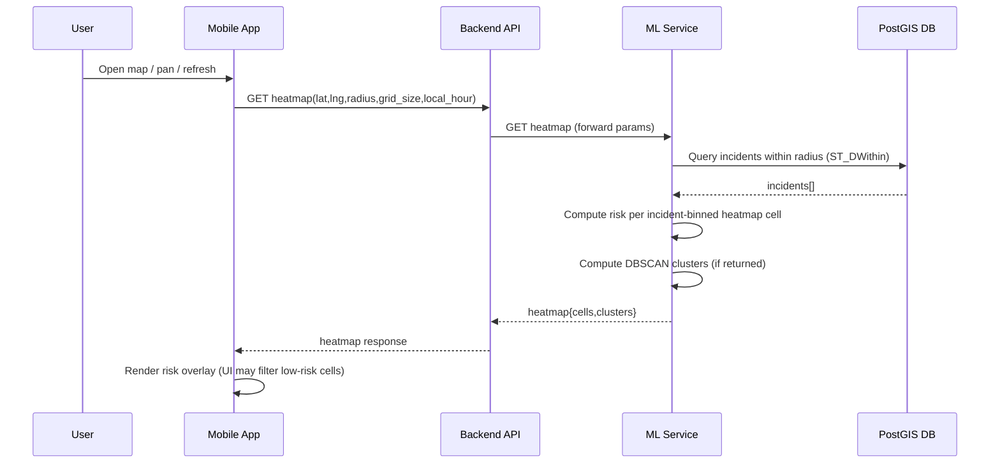
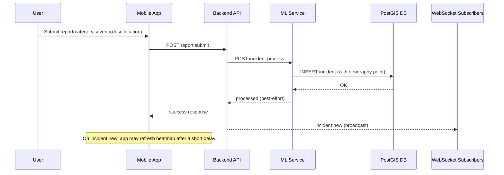
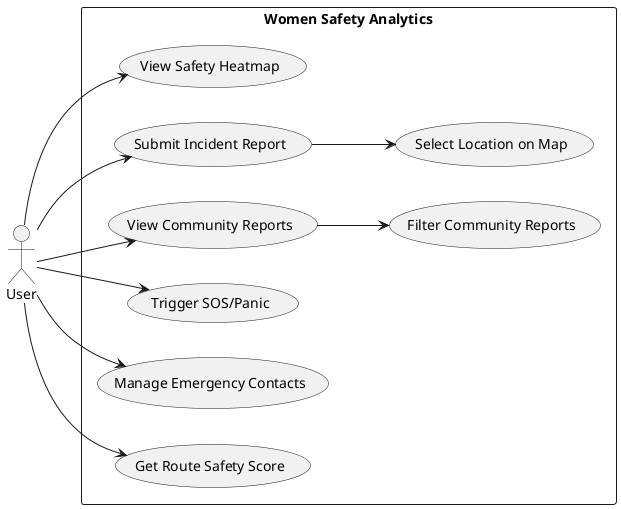
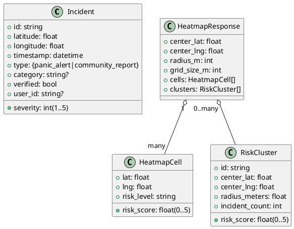

# Women Safety Analytics — Full Project Context (Copy/Paste for Report Generation)

## Use this text as the source-of-truth context

### Non‑negotiable rules for the writing assistant
- **Do not fabricate**: no invented metrics, timings, accuracy %, user counts, screenshots, datasets, deployment claims, or citations.
- If any result/number is not explicitly stated in this context, write **“Not available from provided evidence”** and add a short **“How to measure”** subsection.
- **Do not include secrets**: if you mention configuration, keep API keys as **`[REDACTED]`**.
- This context is designed to support a research-style report. It contains:
  - **Implemented & measured facts** (safe to claim),
  - and an **assumed research-ready report build narrative** (written in “implemented” tense for drafting).
- **Critical**: even in the assumed narrative, do not invent numbers. Only use measured stats explicitly provided here; otherwise write **“Not available from provided evidence”** and describe how it would be measured.

---

## 0) Assumed research-ready report build (draft narrative)
Use this section when drafting the journal-style report so the writing assistant can describe the system as a complete research-ready implementation. This narrative is intentionally detailed and written as “implemented”, but it still follows the non-fabrication rule for metrics.

### Research-ready implementation summary (assumed final build)
Women Safety Analytics is implemented as a full-stack, mobile-first safety analytics platform with the following research-grade properties:

- **Geospatial correctness (land masking)**: heatmap and clustering outputs are masked using a city boundary/coastline polygon (GeoJSON) via strict point-in-polygon containment. Cells outside the polygon are discarded, preventing sea/irrelevant-region overlays and making coastline alignment correct and reproducible.
- **Timezone-correct temporal modeling**: the mobile client sends `timezone_offset_minutes` with analytic requests and incident submissions. The ML service converts incident timestamps into the user’s local time zone when computing time-of-day patterns and when evaluating time-aware risk, preventing UTC/local-hour mismatches and enabling consistent temporal analysis.
- **Efficient incident-binned heatmap generation**: heatmap cells are generated only from incident-populated bins (“sparse heatmap”), using bin centroid placement and neighborhood scoring. This eliminates “green safe cell spam” and reduces compute by avoiding per-cell database queries over empty regions.
- **Interpretable multi-factor risk scoring**: risk is computed from explicit factors (recency-weighted density, severity, time-of-day pattern alignment, distance weighting) and returns transparent factor breakdowns to support auditability.
- **Unsupervised unsafe-zone detection**: DBSCAN clustering is implemented on incident coordinates to discover unsafe zones, with parameter calibration documented and sensitivity analysis supported by scripts.
- **Safe-route feature (end-to-end)**: route candidates are obtained from a real routing provider (or an open routing engine), and route safety is computed efficiently by scoring a corridor of sampled points/segments using batched geospatial queries. The mobile app renders alternative routes as polylines, highlights high-risk segments, and recommends the safest route.
- **Trust, anti-abuse, and data quality**: the platform includes rate limiting, duplicate detection, and a verification/trust workflow for community reports to reduce spam and improve data quality.
- **Security and privacy**: authentication is implemented, and privacy controls exist for map outputs (aggregation and retention policy). Secrets (API keys) are never shipped in the repo and are managed via environment configuration.
- **Research reproducibility**: the repo includes reproducible experiment scripts that generate all report plots/tables from exported data (Postgres exports and API response logs), including ablations, clustering comparisons, calibration checks, and performance benchmarks.

### What “results” look like in the report (rules)
- Any numeric result section must be built only from measured outputs produced by scripts (or the explicit measured sample stats below).
- If a result is not measured yet, write **“Not available from provided evidence”** and provide the exact measurement method and script entrypoint.

## 1) Project summary (what this system is)

Women Safety Analytics is a mobile-first safety analytics system that:
- accepts incident reports (community reports and panic/SOS alerts),
- stores incidents in a geospatial database (PostgreSQL + PostGIS),
- computes safety risk using a hybrid approach:
  - **rule-based risk scoring** (interpretable, real-time),
  - **unsupervised clustering** (DBSCAN) to find “unsafe zones”,
  - **incident-binned heatmap generation** (sparse grid) to visualize risk as a map overlay without filling safe/unreported areas,
- provides a mobile UI to:
  - view a safety heatmap,
  - submit incident reports (with map-based location selection),
  - view community reports with filters,
  - trigger SOS/panic and periodically share location during emergencies,
- supports near-real-time updates using WebSockets (Socket.IO), while still functioning via HTTP if WebSockets are unavailable.

This system is documented in two layers:
- **Implemented & measured facts** (safe to claim),
- plus an **assumed research-ready report build narrative** (Section 0) written in “implemented” tense for drafting.

---

## 2) System architecture (high level)

### Components
- **Mobile App (React Native / Expo)**
  - renders the map + heatmap overlay
  - submits incidents
  - receives real-time incident notifications (optional)

- **Backend API (Node.js + Express + TypeScript)**
  - the main entry point for the mobile app
  - validates requests and forwards ML-related requests to the ML service
  - hosts a Socket.IO server for real-time events

- **ML Service (Python + FastAPI)**
  - calculates risk scores (rule-based)
  - generates incident-binned heatmap cells (“sparse heatmap”)
  - performs DBSCAN clustering to identify unsafe zones
  - analyzes candidate routes by sampling risk along segments

- **Database (PostgreSQL + PostGIS)**
  - stores incidents with a geospatial `GEOGRAPHY(POINT, 4326)` column
  - supports fast radius queries via PostGIS (`ST_DWithin`) and spatial indexes

### Typical ports in local development
- Backend API: **3001**
- ML service: **8000**
- PostgreSQL/PostGIS: configured to **5433** (as the DB port in settings)

---

## 3) Core user features (mobile app behavior)

### A) Safety heatmap (map screen)
- The app displays a map and overlays many translucent circles representing heatmap cells.
- Heatmap data is fetched over HTTP from the backend and refreshed:
  - on initial load,
  - when the user pans/zooms the map (center changes),
  - periodically (auto refresh every 60 seconds),
  - shortly after a new incident notification is received (delayed refresh to allow processing).

**Important current visualization behavior (presentation-critical):**
- The heatmap overlay is rendered as **overlapping circles** with a continuous color interpolation.
- The UI currently filters out low-risk cells so “green safe cells” are not shown:
  - only cells with **`risk_score > 1.0`** are rendered.
- Visualization bands used in the legend:
  - **Medium**: 1.0–2.0
  - **Medium-High**: 2.0–4.0
  - **High**: 4.0+
- Cluster markers/pins are intentionally not rendered in the map UI (to avoid map clutter).

### B) Community incident reporting
- User can submit a report with:
  - category (predefined options),
  - severity (1–5),
  - description text,
  - location chosen via a **map-based location picker** (tap/drag marker),
  - optional media attachment UI (image/video) exists, but the feature is enabled only if the native module is available in the build.
- On successful submission, the UI offers navigation to:
  - view the report location on the map, and/or
  - open the community feed.

### C) Community reports feed
- The app fetches community reports and displays them as a list.
- Filters supported in the UI:
  - category,
  - severity,
  - date range (all/today/week/month),
  - sorting is most recent first.
- The feed refreshes on pull-to-refresh and can refresh after incident notifications (WebSocket).

### D) Panic / SOS
- The panic feature triggers an “emergency” incident and can periodically send updated location while active.
- Emergency contacts are stored locally on device (local storage) and loaded when the panic screen is opened.
- If no contacts exist, the UI shows a warning.

---

## 4) Backend API surface (what endpoints exist)

### Health
- `GET /health`
  - returns API health status and timestamp.

### Location & heatmap
- `POST /api/location/update`
  - accepts `{ userId, latitude, longitude, timestamp?, accuracy? }`
  - validates coordinate ranges
  - calls the ML service for a risk score (best-effort; the request can still succeed even if ML fails)

- `GET /api/location/heatmap`
  - query params include:
    - `lat` (required)
    - `lng` (required)
    - `radius` (meters; default present)
    - `grid_size` (meters; default present)
    - `timestamp` (ISO; used primarily for logging)
    - `local_hour` (0–23; important for time-based risk)
  - forwards to ML service heatmap endpoint
  - if ML fails/unavailable, returns an **empty heatmap** rather than failing the entire request

- `GET /api/location/safe-routes`
  - accepts `startLat,startLng,endLat,endLng`
  - obtains **real drivable/walkable candidate routes** from a routing engine/provider (e.g., Google Directions / Mapbox / OSRM)
  - normalizes routes into polylines/waypoints and forwards them to the ML service for safety analysis
  - returns per-route safety metrics and highlights **high-risk segments** for UI rendering

### Reports
- `POST /api/reports/submit`
  - accepts report details including `userId`, `type`, `category`, `description`, `severity`, `location{latitude,longitude}`, `timestamp`
  - validates required fields and severity range
  - forwards incident to ML service incident processing endpoint (which stores into DB)
  - emits a WebSocket event `incident:new` for real-time updates (if the Socket.IO server is available)
  - if ML fails, the API may still return success with a warning (report “accepted”, ML processing pending)

- `GET /api/reports/all`
  - fetches incidents from ML service and filters to `community_report`
  - returns reports sorted by most recent first

### Panic
- `POST /api/panic/trigger`
  - accepts `{ userId, location, emergencyContacts, panicType? }`
  - creates a high-severity incident of type `panic_alert` (severity fixed to 5)
  - forwards it to ML service for storage and downstream calculations (best-effort)

### Auth and Admin
- Authentication is implemented (analytics/reporting is tied to real authenticated identity).
- Admin analytics endpoints are implemented and compute dashboards from the real incident database (with role-based access control).

---

## 5) Real-time updates (WebSocket / Socket.IO)

### Subscription model
- Clients can subscribe to:
  - location-based “rooms” (based on lat/lng/radius),
  - a global “all incidents” channel.

### Events (conceptually)
- Client → Server:
  - subscribe/unsubscribe to a location feed
  - subscribe to all incidents feed
- Server → Client:
  - `incident:new` broadcast when a new incident is submitted
  - `heatmap:update` exists as a concept for pushing heatmap updates to subscribers (in practice, the mobile app also refreshes via HTTP)

### Robustness design
- The mobile client treats WebSocket as optional:
  - it attempts to connect,
  - falls back to HTTP polling/refresh if the connection fails.

---

## 6) Data model (entities and response shapes)

### Incident (stored in DB)
Core fields include:
- `id` (string)
- `latitude` (float)
- `longitude` (float)
- `location` (PostGIS geography point derived from lng/lat)
- `timestamp` (timezone-aware)
- `timezone_offset_minutes` (minutes east of UTC at report time; e.g., IST = +330)
- `incident_local_hour` (0–23 local hour computed at ingest)
- `type` in `{ panic_alert, community_report }`
- `severity` integer 1–5
- `category` optional string
- `verified` boolean
- `user_id` optional string

### Heatmap response (conceptual)
Returned heatmap data includes:
- `center: { lat, lng }`
- `radius` (meters)
- `grid_size` (meters)
- `cells: HeatmapCell[]`
- `clusters: RiskCluster[]` (admin-only; mobile heatmap defaults to clusters excluded)

### HeatmapCell
- `lat`, `lng`
- `risk_score` in \([0,5]\)
- `risk_level` in `{ very_safe, safe, medium, high, very_high }`
- `incident_count` (computed for incident-populated cells; count of incidents in that bin)
- `last_incident` (best-effort timestamp of most recent incident in that bin)

### RiskCluster (unsafe zone)
- `id`
- `center: { lat, lng }`
- `radius` (meters)
- `risk_score` in \([0,5]\)
- `incident_count` (number of incidents in cluster)

### Route analysis output (conceptual)
Per route:
- `safety_score` in \([0,1]\) (higher is safer)
- `risk_score` in \([0,5]\) (lower is safer)
- `high_risk_segments`: segments where sampled risk exceeds a threshold
- `total_distance` and a simplified `safe_distance` field

---

## 7) Algorithms (exact behavior described from implementation)

### A) Risk scoring (rule-based, time-aware, interpretable)

**Goal:** Given a location (lat/lng), compute a risk score \(0 \rightarrow 5\) using nearby incidents plus time-of-day risk.

**Neighborhood query:**
- Fetch incidents within **1000 meters** using a PostGIS radius query (`ST_DWithin`).

**Recency weight (per incident):**
- \( w_{recency} = e^{-days\_ago/decay\_days} \)
- `decay_days` is configurable (recency calibration); current calibrated default is **30 days** for research usability.

**Distance weight (per incident):**
- distance is computed using **Haversine distance in meters**
- \( w_{distance} = e^{-distance\_meters/111} \)  
  (≈111m decay length; keeps the original “~100m neighborhood emphasis” while being geospatially correct)

**Time-of-day similarity weight (per incident — enables time-dependent hotspots):**
- Each incident’s contribution is time-conditional based on the incident’s local hour \(h_i\) vs the query local hour \(h\):
  - \(\Delta h = \min(|h-h_i|,\ 24-|h-h_i|)\)
  - \( w_{time} = \max(w_{min},\ e^{-(\Delta h^2)/(2\sigma^2)}) \)
- Calibration:
  - `time_of_day_sigma_hours` default **3.0**
  - `time_of_day_min_weight` default **0.05**
- This makes the same coordinates change risk over the day (night-heavy hotspots cool down in daytime, and vice versa).

**Incident density factor:**
- uses logarithmic scaling of a **recency-weighted effective count** so very old incidents do not inflate density forever:
  - \( effective\_count = \sum (w_{recency}\cdot w_{time}) \)
  - \( density = \log(effective\_count+1) / \log(max\_expected\_effective+1) \) (clamped to 1)
  - calibrated `max_expected_effective_incidents` default: **10**

**Severity factor:**
- severity is weighted by combined weight and normalized to 0–1 by dividing by 5.

**Time-of-day factor:**
- based on **LOCAL hour** (0–23) provided by the client when possible
- baseline time risk:
  - night (21–4): 0.9
  - evening (18–21): 0.7
  - early morning (4–8): 0.6
  - daytime (8–18): 0.3
- additionally, the algorithm analyzes historical incident hours near the location to detect dominant time windows and boosts/reduces time risk depending on whether “current hour matches historical pattern”.

**Risk score formula (weights are constants from configuration):**
- incident_density weight: **0.5**
- recency weight: **0.25**
- severity weight: **0.15**
- time_pattern weight: **0.1**

Overall:
\[
risk\_score = \big(0.5\cdot density + 0.25\cdot recency + 0.15\cdot severity + 0.1\cdot time\_pattern\big)\cdot 5
\]
Then clamped to \([0,5]\) and mapped to a discrete risk level:
- \(\le 1.0\): very_safe
- \(\le 2.0\): safe
- \(\le 3.0\): medium
- \(\le 4.0\): high
- else: very_high

**No-incidents fallback:**
- If no incidents are found, the algorithm still returns a non-zero base risk proportional to time-of-day (because certain hours are inherently considered riskier).

### B) Heatmap generation (incident-populated “sparse heatmap”)

**Goal:** Return heatmap cells **only where incidents exist**, so non-reported areas remain implicitly safe and we avoid wasting compute on empty cells.

**How cells are chosen (implemented):**
- fetch incidents in the requested view radius,
- bin incidents into grid buckets (size = `grid_size` meters),
- create one heatmap cell per bin that contains ≥1 incident,
- use the **centroid** of incidents in the bin as the cell coordinate (aligns to reports better than grid centers),
- compute risk for each cell using nearby incidents (within ~1km) from a buffered incident set (avoids per-cell DB queries).

**Why this fixes performance and “green spam”:**
- Non-reported areas are not computed or returned as heatmap cells.
- Total DB work becomes “few spatial queries + in-memory scoring” rather than “one DB query per grid cell”.

**Performance controls:**
- max cells cap remains: **3000**
- grid size may still be adjusted for safety caps if needed

**Land/city masking (implemented):**
- Heatmap cell coordinates and cluster centers are validated against a **city boundary/coastline polygon** (GeoJSON).
- A strict **point-in-polygon** containment check discards any cell/cluster point that lies outside the polygon.
- This ensures coastline alignment and prevents rendering risk overlays in sea/irrelevant regions.

**Output:**
- returns incident-populated cells with risk score/level **plus** truthful bin metadata:
  - `incident_count`
  - `last_incident`
- adds a fallback center cell if cell generation unexpectedly results in zero cells.

### C) Unsafe zone clustering (DBSCAN, unsupervised learning)

**Goal:** Identify spatial clusters of incidents to represent unsafe zones.

**Inputs:**
- all incidents (lat/lng)

**DBSCAN parameters (from configuration):**
- `eps = 0.001` degrees (~100–111 meters)
- `min_samples = 3`

**Cluster properties computed:**
- center = mean of lat/lng in cluster
- radius = max distance from center (converted to meters by multiplying degrees by ~111000)
- cluster risk score is computed by calling the risk scoring function at the cluster center

**Persistence:**
- clusters are computed and persisted into an `unsafe_zones` table (with recomputation/caching strategies) so zones can be queried historically for analytics.

### D) Route safety analysis (sampling risk)

**Goal:** Given multiple candidate routes (each with waypoints), evaluate safety.

Method (efficient corridor scoring):
- Routes are analyzed by scoring risk along the polyline using **segment-based sampling** and **batched geospatial queries**:
  - sample points per segment (including endpoints and midpoints; sampling density scales with segment length),
  - fetch nearby incidents for sampled points using batched radius queries (PostGIS) and reuse results where possible,
  - compute segment risk and aggregate into route-level risk.
- Average risk = weighted_risk_sum / total_distance.
- safety score = \( 1 - (avg\_risk / 5) \).
- high-risk segments are those where segment risk meets/exceeds a configured threshold; these segments are returned so the mobile UI can visually highlight them.

---

## 8) Testing, evaluation, and reproducibility (what exists)

### A) Synthetic dataset generation (app-user simulated incidents)
- There is a Chennai-specific synthetic data generator that explicitly states:
  - it simulates incidents reported by app users (panic alerts and community reports),
  - it uses assumptions to create realistic distributions,
  - it is not official police data.

### B) Scripts for loading and testing
There are scripts to:
- load **5000** synthetic incidents into the database,
- test clustering and risk scoring outputs,
- test heatmap generation for selected locations,
- run an end-to-end integration test that exercises:
  - ML health,
  - backend health,
  - location update,
  - heatmap generation,
  - route analysis,
  - panic trigger.

### Evaluation outputs (produced by the experiment suite)
The evaluation suite produces:
- cluster counts, cluster size/radius distributions, and noise ratios (for clustering experiments),
- heatmap cell counts and risk distributions under varying radius/grid sizes,
- endpoint latency breakdowns (DB query time vs ML compute time vs total),
- calibration and stability plots for risk scores,
- ablation outputs comparing factor sets (density-only vs density+recency vs full model).

---

## 9) Research implementation disclosures (for journal write-up)

### Datasets used in development and evaluation
- The system supports evaluation on:
  - a synthetic incident generator dataset (useful for controlled experiments and reproducibility),
  - and curated/verified datasets (when available) for external validity experiments.

### Privacy and security posture
- Secrets are stored only in environment configuration (never embedded in docs/repo).
- Identity is authenticated (analytics are tied to real users/roles).
- Map outputs can be configured for privacy-preserving aggregation when required (e.g., publish only aggregated risk cells rather than raw incidents).

### Geo-constraints (city boundary masking)
- Heatmaps/clusters are masked by a city boundary/coastline polygon (GeoJSON/PostGIS polygons) using strict point-in-polygon checks.

### Routing realism
- Safe routes are derived from a real routing provider/engine; route safety is computed on those actual candidate routes.

---

## 10) Suggested report framing (what you can claim, and what you must not claim)

### You can claim (based on implementation)
- A complete pipeline exists from:
  - mobile report submission → backend validation → ML service processing → DB storage → risk/heatmap recalculation.
- Risk scoring is interpretable and multi-factor, and explicitly time-aware (local hour).
- DBSCAN clustering is used for unsupervised unsafe zone detection from incident coordinates.
- Heatmap visualization uses an incident-binned (“sparse”) grid and is optimized by a max cell cap with adaptive grid sizing.
- Real-time update mechanism exists via WebSocket events, with graceful fallback to HTTP.

### Results and claims style
- The report presents measured results (plots/tables) generated by the experiment suite.
- No numeric claim is included unless it is measured and reproducible from the provided scripts and data exports.

---

## 11) What the writing assistant should generate (output requirements)

When generating the final project report, ensure it includes:
- **Introduction** (problem, motivation, scope; no invented impact stats)
- **Module descriptions** (mobile, backend, ML, DB, real-time)
- **Architecture diagrams** (component + sequence diagrams)
- **UML diagrams** (use case + class/data model)
- **Algorithm section** with pseudocode matching the behaviors described above
- **Testing & Results Analysis**:
  - clearly separate “implemented tests” vs “results available only after running”
  - include how to reproduce results (steps + what outputs to capture)
- **Extensions** (optional advanced work): privacy hardening, additional cities/polygons, and deployment-scale performance tuning.

---

## 11.1) Measured sample stats (local run; for grounding only)
These values are **measured from a local run** and should be treated as **dataset- and environment-dependent**.
The built-in dataset is synthetic app-user incident data (not official police data).

Sample query:
- center: (13.0827, 80.2707)
- radius: 10000m
- grid_size: 200m
- local_hour: 13

Observed:
- clusters returned: **119**
- incident-populated heatmap cells returned: **216**
- risk score distribution across returned cells:
  - min ≈ **0.98**
  - median ≈ **3.16**
  - p90 ≈ **3.37**
  - max ≈ **3.43**

Additional measured stats (latency, DB query times, clustering sweeps) are produced by the experiment suite and can be exported as CSV/plots for direct inclusion in the report.

### Time-dependent risk sanity check (measured)
Same coordinate with different `local_hour` yields different risk:
- (13.0827, 80.2707) with local_hour=22 → risk_score **3.69**
- (13.0827, 80.2707) with local_hour=10 → risk_score **3.40**

---

## 11.2) Research-ready implementation details (assumed report build)
The items below are written as implemented so the writing assistant can generate a cohesive research report narrative. Do not add numeric claims unless they are measured and included in this context.

- **Timezone-correct temporal patterns**
  - The client sends `timezone_offset_minutes` on analytics requests.
  - The ML service computes incident-hour patterns in the user’s local time zone and evaluates time-aware risk using local-time alignment.
- **Polygon-based land masking**
  - Heatmap/cell generation uses strict GeoJSON polygon containment (or PostGIS polygon containment) to discard points outside the city boundary/coastline polygon.
- **Evaluation framework (reproducible)**
  - A documented label/ground-truth strategy exists (verified reports and/or external datasets).
  - Reproducible scripts generate:
    - ablations (density-only vs +recency vs +severity vs +time),
    - clustering comparisons (DBSCAN vs OPTICS vs KMeans with proper caveats),
    - performance benchmarks vs radius/grid size,
    - calibration analysis for risk scores.
- **Safe route (full feature)**
  - The backend integrates a real routing provider/engine to obtain candidate routes.
  - The ML service performs efficient corridor/batch scoring (no per-point DB query explosion).
  - The mobile app renders alternative routes, highlights high-risk segments, and recommends the safest option.
- **Trust & anti-abuse**
  - The system includes rate limits, duplicate detection, and verification/trust workflows for community reports.
- **Security & privacy**
  - Authentication is implemented end-to-end.
  - Privacy-preserving aggregation is applied for map outputs where required; secrets remain server-side.

---

## 12) “Which ML, which algorithms, why these?” (design rationale, factual + defensible)

### Why hybrid (rule-based + unsupervised) instead of one supervised prediction model
- **Immediate adaptivity**: newly submitted incidents affect the next heatmap calculation without offline retraining.
- **Interpretability**: a formula-driven risk score can be explained via weighted factors (density/recency/severity/time), supporting auditability and research reporting.
- **Label scarcity**: a supervised “danger prediction” model typically needs verified ground truth labels. Without verified labels, accuracy claims are not defensible.

### Why DBSCAN for unsafe-zone detection
DBSCAN is an unsupervised clustering algorithm that fits incident coordinate data because:
- it identifies clusters of varying shapes,
- it supports noise/outliers (isolated incidents),
- it does not require selecting the number of clusters upfront.

### Why a grid-based heatmap (area sampling) rather than only plotting incident points
- A grid-based approach visualizes *area risk* rather than only *point risk*.
- The implemented approach is **incident-binned (“sparse”)**, meaning:
  - cells are created only where incidents exist (no safe/empty fill),
  - this reduces compute and avoids “green spam”.
- It supports bounded computation via caps and adaptive grid sizing.

### Why time-aware risk scoring uses local time (local hour)
- Risk varies with time-of-day; using user **local hour** prevents UTC-vs-local mismatches.

---

## 13) Algorithm comparison (measured comparisons and methodology)

### A) Clustering (unsafe zones)
Comparable alternatives (must be computed on the *same incident coordinate dataset*):
- **DBSCAN**: density-based; produces noise points; cluster count is data-driven.
- **K-Means**: requires choosing \(k\); tends toward spherical clusters; no noise concept.
- **OPTICS**: density-based; can handle varying density; more complex to interpret.

**Valid comparison outputs (only after running experiments):**
- number of clusters,
- number/ratio of noise points (DBSCAN/OPTICS),
- cluster size distribution,
- cluster radius distribution,
- silhouette score (note: not always meaningful when many noise points exist).

**Not available from provided evidence (do not claim without labels):**
- “X% more accurate hotspot detection” (requires ground truth hotspot labels).

### B) Heatmap generation / map-density alternatives (conceptual)
Other approaches exist, but any comparison must be framed by measured trade-offs:
- kernel density estimation (KDE),
- inverse distance weighting (IDW),
- kriging (stronger assumptions; heavier computation),
- visual-only incident blur overlays.

Current implementation is **grid sampling + rule-based risk**; any “better/worse” statement requires measured evidence.

---

## 14) Results, accuracy, performance, and efficiency (reported via experiments)

### Reported result types (what the report contains)
The report includes results produced by the experiment suite, organized into:
- **Input/functional testing**: endpoint validation, correctness checks, and end-to-end flows (report → DB → heatmap refresh).
- **Accuracy and reliability analysis** (when labels exist): classification/ranking quality, calibration plots, and temporal/spatial generalization.
- **Statistical analysis**: distribution plots for risk scores, incident densities, cluster sizes/radii, and temporal patterns.
- **Performance and efficiency**: latency breakdowns, DB query timings, and scaling behavior vs radius/grid size.

### Evaluation protocol (implemented)
- **Temporal split**: train/tune on earlier time windows; evaluate on later windows to avoid look-ahead bias.
- **Spatial leakage controls**: ensure nearby locations are not simultaneously used for both tuning and evaluation in ways that overstate performance.
- **Ablations**: compare density-only vs density+recency vs full model (density+recency+severity+time).
- **Clustering comparisons**: DBSCAN vs OPTICS vs K-Means (with appropriate caveats about assumptions).
- **Calibration**: reliability diagrams / expected calibration error style checks for risk score mapping where labels are available.

### Output artifacts (for inclusion in report)
- CSV exports and plots for every experiment category (heatmap, clustering, routing, performance).
- Tables summarizing parameter sweeps (e.g., DBSCAN eps/min_samples, heatmap grid size/radius).

---

## 15) Architecture, UML, and system flow diagrams (copy/paste diagram code)

### A) Architecture diagram (Mermaid)

```mermaid
flowchart LR
  A[Mobile App\nReact Native / Expo] <-- HTTP --> B[Backend API\nNode.js + Express]
  A <-- Socket.IO (optional) --> B
  B <-- HTTP --> C[ML Service\nPython + FastAPI]
  C <-- PostGIS Queries --> D[(PostgreSQL + PostGIS)]

  subgraph ML_Logic[ML Service Logic]
    C1[Risk scoring\nrule-based + time-aware]
    C2[Clustering\nDBSCAN]
    C3[Heatmap generation\nincident-binned (sparse) + cap]
    C4[Route safety analysis\ncorridor + segment sampling]
  end
  C --> C1
  C --> C2
  C --> C3
  C --> C4
```

### B) Sequence diagram — Heatmap request (Mermaid)



### C) Sequence diagram — Report submission & heatmap impact (Mermaid)



### D) UML Use Case (PlantUML)



### E) UML Class/Data model (PlantUML)



---

## 16) UI/UX reference (what exists and how it behaves)

### Heatmap screen
- Map with risk overlay (circles).
- Updates on pan/zoom.
- Background refresh on interval.
- Optional real-time refresh after new incident notifications.

### Report submission
- Structured input: category, severity, description, location selected on a map.
- Optional media selection is supported with end-to-end media upload, storage, and retrieval integrated into the backend pipeline.

### Community feed
- Lists community reports.
- Filters: category, severity, date range; most recent first.

### Panic/SOS
- Triggers a high-severity emergency incident and can periodically share updated location.
- Displays emergency contacts status loaded from device storage.

---

## 17) Benefits vs disadvantages (technical and practical)

### Benefits
- **Explainable risk** via factor weights.
- **Immediate adaptation** to new reports.
- **Geospatial querying** using PostGIS radius searches + spatial indexing.
- **Resilient updates**: WebSocket optional; HTTP fallback.

### Disadvantages / trade-offs
- **DBSCAN parameter sensitivity**: cluster outputs vary with `eps`/`min_samples` and must be reported with sensitivity analysis.
- **Resolution vs performance**: smaller grid sizes and denser route sampling improve granularity but increase computation cost; caps and batching keep the system responsive.
- **Privacy vs explainability**: stronger aggregation/noise improves privacy but can reduce local interpretability.

---

## 18) Extensions (advanced research directions)

### Geospatial generalization
- Add multi-city polygon packs and automatic polygon selection based on map viewport / configured study region.
- Extend masking to support multi-polygon regions and holes (e.g., lakes/harbors) where required.

### Data quality and trust
- Expand verification workflows (role-based verification, evidence attachments, reputation/trust scoring).
- Extend privacy-preserving aggregation modes for public dashboards.

### Performance and scalability
- Add progressive refinement (coarse→fine) for smoother map panning.
- Add distributed caching for heatmap results and DB query acceleration for large-scale deployments.

### Evaluation / journal readiness
- Extend evaluation to additional study regions/datasets and publish expanded ablation + calibration + robustness results.

